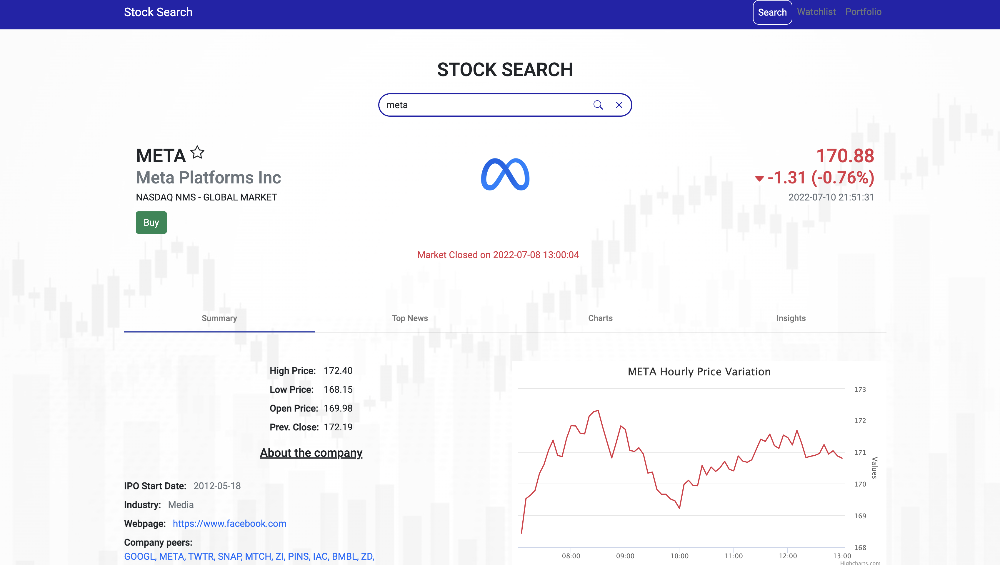
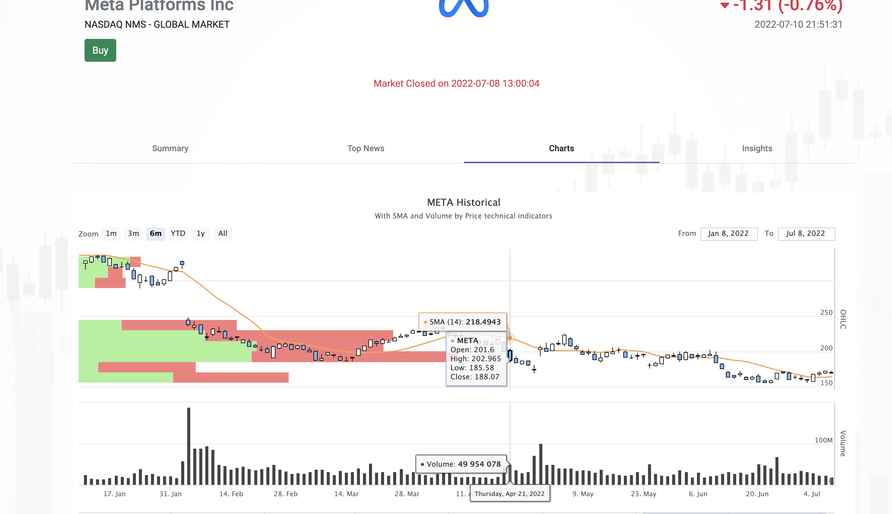
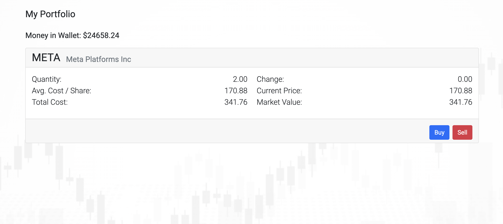
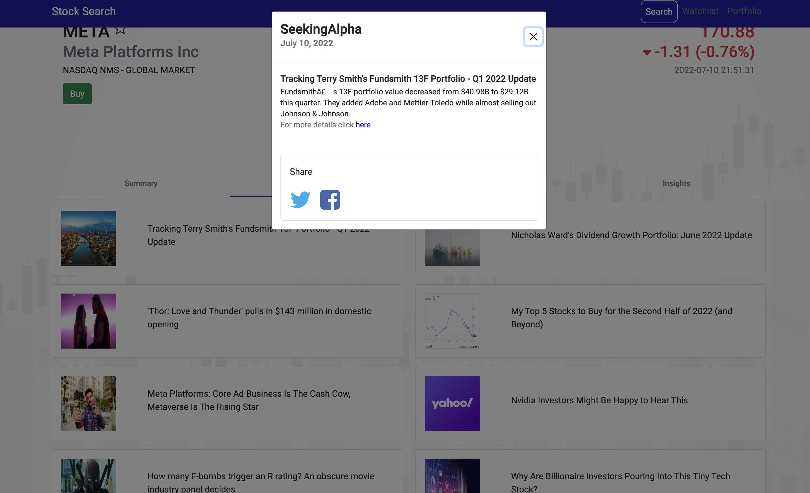
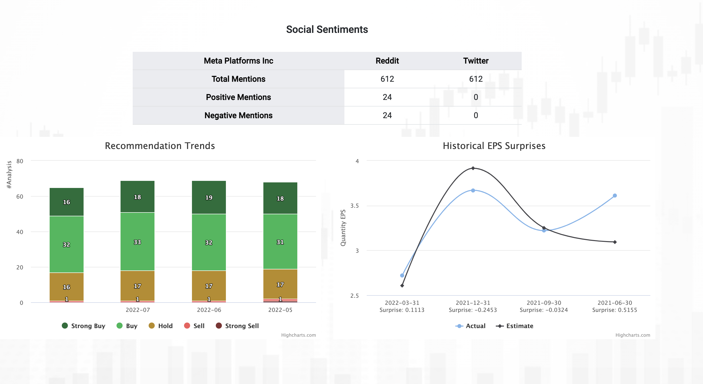

# Stock-App
## About
Mean App for stimulating real time stock trading.
#### [View the application live](https://csci571-stocksearch-angular.wl.r.appspot.com/portfolio)

#### [View the iOS App](https://drive.google.com/file/d/12tB-w4R6UW7-Xm_sY63b2Yzw_eROFiST/view)
## Technology
1. Frontend developed using Angular JS
2. Backend developed using Node JS
3. Used Material tabs to display company details
4. Finnhub API is used for fetching all the results
5. Portfolio and Watchlist created using browser Local Storage
6. Used Modal windows feature to simulate transactions
7. Facebook and Twitter developer API to share news on Social platforms
8. State management between Search, Portfolio, and Watchlist using Angular libraries
9. Developed using VS Code
10. Deployed on Google Cloud App Engine

## Features

-  Stock Search
  - The search bar has the auto-complete feature
  -  It used the <> method to call the auto-complete API after specific intervals
  -  It provides the API results and provides a feature to select stock from the results
  -  The cross button is used to clear the search bar and also clear the page if there are any results displayed
  
-   News Tab
    -   It displays the latest news in the card format returned by the API
    -   Feature to read particular news is developed using Modal window feature of Angular JS
    -   There is a feature to share the news to social platforms, Facebook and Twitter
    -   You can refer to the complete article by clicking the hyperlink
-   Highcharts
    -   Integrated Highcharts API to display the market trends
    -   The charts are responsive to select the date range to see the results
-   Watchlist
    -   There is a feature to add the stocks to the watchlist to have a closer look at their performance
    -   A stock can be added to the watchlist by clicking the star next to the company name
    -   Once a stock is added to the watchlist, the details are added to the browser's local storage
    -   The watchlist page loads the key details about the Stock price and the latest performance of the Stocks which are added to the watchlist
    -   The cards also have the feature to show the company details when clicked
-   Portfolio
    -   This page displays the stocks the user has bought and currently holds
    -   It also gives functionality to add more or sell the currently bought stocks from this page
    -   It displays the current balance in the wallet
    -   It displays the current worth of the user, that is the sum of the current balance and current worth of all the stocks
    -   This page also displays the current standing of a particular stock and the average amount invested in the stock based on buy price and current price
    
    ## Angular Screenshots

